# Database design

The database is PostgreSQL, hosted by Supabase. Everything is defined in
`supabase/migrations/` (plain SQL, applied in filename order), so the same
schema can run on Supabase Cloud or a self-hosted server later.

| Migration | Phase | What it creates |
|---|---|---|
| `…0100_doctors_and_audit.sql` | 1 | `doctors`, verification, admin approval, doctor directory, `audit_log` |
| `…0200_patient_records.sql` | 2 | `patients` and all record-section tables, owner-only access |
| `…0300_consultations.sql` | 4 | `consults`, per-section sharing, message thread, revoke/close |
| `…0400_storage_profile_files.sql` | 1 | Private buckets for profile photos and licence documents |
| `…0500_referrals_and_sync.sql` | 2 | Referrals (co-management / transfer), ownership history, soft delete of entries, offline-sync functions |
| `…0600_investigations_and_files.sql` | 3 | Departments (`facilities`), lab/radiology staff accounts, investigation requests and results, attachments, the `clinical-files` bucket, the staff inbox functions |
| `…0700_notifications_and_consult_files.sql` | 4 | Notifications, push device registration, the `consult-files` bucket, `my_consults` / `my_referrals` lists |
| `…0800_doctor_grade_and_search.sql` | 4 | Doctor grade (resident / specialist / consultant); directory search matches every word against name, specialty, hospital or grade |

Migration 3 (consults) was written early so the whole security model could be
designed and tested as one piece. Its screens come in Phase 4.

## ER diagram

GitHub draws this diagram automatically. `PK` = primary key, `FK` = link to another table.

```mermaid
erDiagram
    AUTH_USERS ||--|| DOCTORS : "profile created on sign-up"
    DOCTORS ||--o{ PATIENTS : owns
    DOCTORS ||--o{ CONSULTS : "requests (requester)"
    DOCTORS ||--o{ CONSULTS : "is asked (consultant)"
    DOCTORS ||--o{ CONSULT_MESSAGES : sends
    FACILITIES ||--o{ DOCTORS : "staff work in"
    FACILITIES ||--o{ INVESTIGATION_REQUESTS : "inbox receives"

    PATIENTS ||--o{ PRESENTING_COMPLAINTS : has
    PATIENTS ||--o{ MEDICAL_CONDITIONS : "past medical"
    PATIENTS ||--o{ SURGICAL_HISTORY : "past surgical"
    PATIENTS ||--o{ MEDICATIONS : "drug history"
    PATIENTS ||--o{ ALLERGIES : has
    PATIENTS ||--o{ FAMILY_HISTORY : has
    PATIENTS ||--o| SOCIAL_HISTORY : has
    PATIENTS ||--o{ EXAMINATIONS : "exam + vitals"
    PATIENTS ||--o{ SURGICAL_CASES : "surgical care"
    SURGICAL_CASES ||--o{ POSTOP_FOLLOWUPS : "follow-up"
    PATIENTS ||--o{ INVESTIGATION_REQUESTS : requests
    INVESTIGATION_REQUESTS ||--o{ INVESTIGATION_RESULTS : "results"
    PATIENTS ||--o{ INVESTIGATION_RESULTS : "results (also without a request)"
    INVESTIGATION_RESULTS ||--o{ ATTACHMENTS : "report photos, PDFs"
    POSTOP_FOLLOWUPS ||--o{ ATTACHMENTS : "wound photos"

    PATIENTS ||--o{ CONSULTS : "shared through"
    PATIENTS ||--o{ REFERRALS : "referred through"
    DOCTORS ||--o{ REFERRALS : "refers / receives"
    PATIENTS ||--o{ PATIENT_OWNERSHIP_HISTORY : "owned by, over time"
    CONSULTS ||--|{ CONSULT_SECTIONS : "ticked sections"
    CONSULTS ||--o{ CONSULT_MESSAGES : thread
    DOCTORS ||--o{ NOTIFICATIONS : receives
    DOCTORS ||--o{ DEVICE_TOKENS : "phones (push)"

    DOCTORS {
        uuid id PK "same as auth.users.id"
        text full_name
        text specialty
        text hospital
        text license_number "unique"
        text phone
        text photo_path "private bucket"
        text license_document_path "private bucket"
        text preferred_language "en or ar"
        enum role "doctor or admin"
        enum verification_status "pending, verified, rejected, suspended"
        text grade "resident, specialist or consultant"
        text account_type "doctor or staff"
        uuid facility_id FK "staff only"
    }
    FACILITIES {
        uuid id PK
        text name "e.g. Main Lab"
        enum kind "lab, radiology, pathology, other"
        text hospital
    }
    INVESTIGATION_REQUESTS {
        uuid id PK
        uuid patient_id FK
        enum kind "lab, imaging, pathology, other"
        text_array tests
        enum urgency "routine, urgent, stat"
        uuid facility_id FK "null = doctor enters the result"
        enum status "requested, sample_taken, result_uploaded, reviewed, cancelled"
        text clinical_notes
    }
    INVESTIGATION_RESULTS {
        uuid id PK
        uuid patient_id FK
        uuid request_id FK "optional"
        text title
        date result_date
        jsonb lab_values "typed values with unit and range"
        text report_text
        text source "doctor or staff"
    }
    ATTACHMENTS {
        uuid id PK
        uuid patient_id FK
        enum section "investigations or surgical_care"
        uuid result_id FK
        uuid followup_id FK
        text storage_path "section/patient/file"
        text mime_type "jpeg, png, pdf"
        text caption
    }
    PATIENTS {
        uuid id PK
        uuid owner_id FK
        text full_name "only required field"
        date date_of_birth
        smallint age_years "if DOB unknown"
        enum sex
        text national_id
        text file_number
        text phone
        text address
        text emergency_contact_name
        text primary_diagnosis
        text_array tags "post-op, awaiting surgery"
        timestamptz deleted_at "soft delete"
    }
    ALLERGIES {
        uuid id PK
        uuid patient_id FK
        text allergen
        text reaction
        enum severity
    }
    EXAMINATIONS {
        uuid id PK
        uuid patient_id FK
        timestamptz examined_at
        text findings
        smallint pulse_bpm
        smallint systolic_mmhg
        smallint diastolic_mmhg
        numeric temperature_c
        smallint spo2_percent
        numeric weight_kg
    }
    SURGICAL_CASES {
        uuid id PK
        uuid patient_id FK
        text diagnosis
        text planned_operation
        date planned_date
        enum status
        jsonb preop_checklist
        text operative_notes
    }
    CONSULTS {
        uuid id PK
        uuid patient_id FK
        uuid requester_id FK
        uuid consultant_id FK
        text question
        enum urgency
        boolean anonymized
        boolean consent_confirmed "must be true"
        date consent_date
        enum status "pending, answered, closed"
        timestamptz expires_at "1 to 90 days"
        timestamptz revoked_at
    }
    CONSULT_SECTIONS {
        uuid consult_id PK
        enum section PK
    }
    CONSULT_MESSAGES {
        uuid id PK
        uuid consult_id FK
        uuid sender_id FK
        text body
        text_array attachment_paths
    }
    REFERRALS {
        uuid id PK
        uuid patient_id FK
        uuid from_doctor_id FK
        uuid to_doctor_id FK
        enum kind "comanagement or transfer"
        text note
        boolean consent_confirmed "must be true"
        date consent_date
        enum status "pending, accepted, declined, cancelled, ended"
    }
    PATIENT_OWNERSHIP_HISTORY {
        bigint id PK
        uuid patient_id FK
        uuid doctor_id FK
        timestamptz owned_from
        timestamptz owned_until "set on transfer"
    }
    NOTIFICATIONS {
        uuid id PK
        uuid recipient_id FK
        text kind "consult_request, consult_message, referral_request, referral_response, lab_request"
        uuid ref_id "the consult, referral or request; no patient data"
        timestamptz read_at
    }
    DEVICE_TOKENS {
        text token PK "push address; not readable through the API"
        uuid user_id FK
    }
    AUDIT_LOG {
        bigint id PK
        timestamptz occurred_at
        uuid actor_id
        enum action "view, create, update, delete, share, revoke, verify"
        text table_name
        uuid record_id
        uuid patient_id
        jsonb details "metadata only, never clinical values"
    }
```

Every section table (complaints, conditions, surgical history, medications,
allergies, family, social, examinations, surgical cases, follow-ups) also has
`created_by`, `created_at`, `updated_at` and `deleted_at` (entered in error).
The diagram leaves these out to stay readable.

## Record sections and sharing

Each table belongs to one **section**. Sections are the checkboxes on the
Consult screen.

| Section (`record_section`) | Tables |
|---|---|
| `identifiers` | personal fields on `patients` (only via `get_consult_patient()`) |
| `presenting_complaint` | `presenting_complaints` |
| `past_medical` | `medical_conditions` |
| `past_surgical` | `surgical_history` |
| `medications` | `medications` |
| `allergies` | `allergies` |
| `family_history` | `family_history` |
| `social_history` | `social_history` |
| `examination` | `examinations` |
| `investigations` | `investigation_requests`, `investigation_results`, their `attachments` |
| `surgical_care` | `surgical_cases`, `postop_followups`, wound-photo `attachments` |

## Security model in plain words

0. **Three kinds of access.**
   - The **owner** (primary doctor) has everything.
   - A **co-manager** (accepted co-management referral) reads and edits the
     whole record, but cannot delete the patient, share or transfer it.
   - A **consultant** (live consult) reads only the ticked sections.
   - After a **transfer**, the previous owner keeps read-only access to entries
     recorded up to the transfer time.
   - A referral lasts until it is ended. Closing or revoking a consult never
     affects it.
1. **Nobody sees anything by default.** Every table has Row-Level Security on,
   and every permission is granted explicitly.
2. **Owner rule.** A doctor sees and edits only the patients they created.
3. **Consult rule** (function `can_read_section`). Another doctor can read a
   section only if all of these hold:
   - a consult exists for that patient, addressed to them
   - that section was ticked
   - the consult isn't revoked, closed or expired
   - their account is verified
   - identifiers are never visible through an anonymized consult
4. **Read-only.** Consultants can never insert, change or delete record data.
5. **Sharing only through checks.** Consults can only be created by
   `create_consult()`. It requires both doctors to be verified, patient consent
   with a date, at least one section, and a duration of 1–90 days.
6. **Instant revoke.** Access is checked again on every request, so a revoke
   takes effect immediately.
7. **Audit.** Every create, update, delete, share, revoke, verification and
   consultant view is logged automatically. The app also logs when the owner
   opens a section. The log is append-only and stores no clinical values.
   Owners can see who accessed their patients.
8. **No hard deletes.** Patients and record entries are soft-deleted
   (`deleted_at`, "entered in error") because medical records must be kept.
   This is also how offline phones learn about deletions.
9. **Lab and radiology staff** (account type `staff`, approved by an admin,
   belonging to one department):
   - can never own patients, be consulted or referred to, or appear in the
     doctor directory
   - see only requests sent to their department, through the `staff_*`
     functions, never the record tables themselves
   - for each request they see: name, age, sex, file number, allergies, the
     requested tests and notes, and earlier results of the same kind
   - lose access as soon as the doctor marks the result reviewed or cancels
     the request
   - results they send can't be edited by doctors, only marked "entered in error"
   - an edit from an older offline copy can never move a request's status backwards
10. **Files** live in the private `clinical-files` bucket at
    `<section>/<patient id>/<random name>`, readable only by those who may
    read that section (and staff while a request is open). Files can't be
    changed or deleted, only their attachment marked "entered in error".
11. **Notifications** hold only what happened and an id, never patient data.
    Only database triggers create them, so nobody can send fake alerts. A
    push says only e.g. "New consult request"; the app loads the details after
    sign-in. Push addresses can't be read through the API, and a phone moves to
    whoever signed in on it last. Consult files (`consult-files` bucket) are
    visible only to the two doctors of that consult.
12. **Offline copies.**
   - `sync_pull()` returns only patients the doctor may edit (owned or
     co-managed); consult readers never get an offline copy.
   - `my_patient_ids()` tells the phone which patients to delete from its
     cache when access ends.

The same rules exist in Kotlin (`core/domain/.../permissions/`) so the app can
hide buttons the server would refuse. **The server is the one that enforces
them.**

## Tests

- `supabase/tests/10_security_tests.sql` (77 checks),
  `20_referral_and_sync_tests.sql` (43 checks) and
  `30_investigations_tests.sql` (61 checks) and
  `40_notifications_and_consult_files_tests.sql` (31 checks) and
  `50_doctor_grade_tests.sql` (8 checks) run against the real migrations. Anonymous users, the owner, a stranger, a consultant, a
  co-manager, a pending doctor and an admin each try allowed and forbidden
  actions. Run them with `supabase/tests/run_local.sh`; CI runs them on
  every push.
- `core/domain/src/test/` has the Kotlin unit tests for the same rules.
