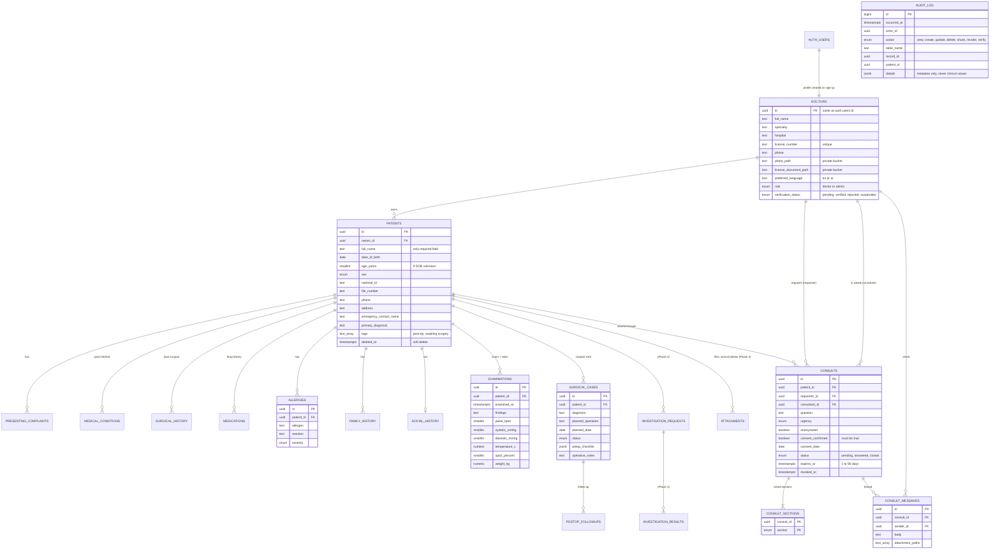

# Database design

The database is PostgreSQL, hosted by Supabase. Everything is defined in
`supabase/migrations/` (plain SQL, applied in filename order), so the same
schema can run on Supabase Cloud or a self-hosted server later.

| Migration | Phase | What it creates |
|---|---|---|
| `…0100_doctors_and_audit.sql` | 1 | `doctors`, verification, admin approval, doctor directory, `audit_log` |
| `…0200_patient_records.sql` | 2 | `patients` and all record-section tables, owner-only access |
| `…0300_consultations.sql` | 4 | `consults`, per-section sharing, message thread, revoke/close |
| `…0400_storage_profile_files.sql` | 1 | Private buckets for profile photos and licence documents |

Migrations 2 and 3 are written now so the security model can be designed and
tested as one piece. The app screens that use them come in Phases 2 and 4.
Tables marked *(Phase 3)* in the diagram are planned but not created yet.

## ER diagram

GitHub draws this diagram automatically. `PK` = primary key, `FK` = link to another table.

Every section table (complaints, conditions, surgical history, medications,
allergies, family, social, examinations, surgical cases, follow-ups) also has
`created_by`, `created_at` and `updated_at`. The diagram leaves these out to
stay readable.

## Record sections and sharing

Each table belongs to one **section**. Sections are the checkboxes on the
Consult screen.

| Section (`record_section`) | Tables |
|---|---|
| `identifiers` | personal fields on `patients` (only via `get_consult_patient()`) |
| `presenting_complaint` | `presenting_complaints` |
| `past_medical` | `medical_conditions` |
| `past_surgical` | `surgical_history` |
| `medications` | `medications` |
| `allergies` | `allergies` |
| `family_history` | `family_history` |
| `social_history` | `social_history` |
| `examination` | `examinations` |
| `investigations` | Phase 3 tables |
| `surgical_care` | `surgical_cases`, `postop_followups` |

## Security model in plain words

1. **Nobody sees anything by default.** Every table has Row-Level Security on,
   and every permission is granted explicitly.
2. **Owner rule.** A doctor sees and edits only the patients they created.
3. **Consult rule** (function `can_read_section`). Another doctor can read a
   section only if all of these hold:
   - a consult exists for that patient, addressed to them
   - that section was ticked
   - the consult isn't revoked, closed or expired
   - their account is verified
   - identifiers are never visible through an anonymized consult
4. **Read-only.** Consultants can never insert, change or delete record data.
5. **Sharing only through checks.** Consults can only be created by
   `create_consult()`. It requires both doctors to be verified, patient consent
   with a date, at least one section, and a duration of 1–90 days.
6. **Instant revoke.** Access is checked again on every request, so a revoke
   takes effect immediately.
7. **Audit.** Every create, update, delete, share, revoke, verification and
   consultant view is logged automatically. The app also logs when the owner
   opens a section. The log is append-only and stores no clinical values.
   Owners can see who accessed their patients.
8. **No hard deletes.** Patients are soft-deleted (`deleted_at`), because
   medical records must be kept.

The same rules exist in Kotlin (`core/domain/.../permissions/`) so the app can
hide buttons the server would refuse. **The server is the one that enforces
them.**

## Tests

- `supabase/tests/10_security_tests.sql` runs 77 checks against the real
  migrations: anonymous users, the owner, a stranger, a consultant, a pending
  doctor and an admin each try allowed and forbidden actions. Run it with
  `supabase/tests/run_local.sh`. CI runs it on every push.
- `core/domain/src/test/` has the Kotlin unit tests for the same rules.
